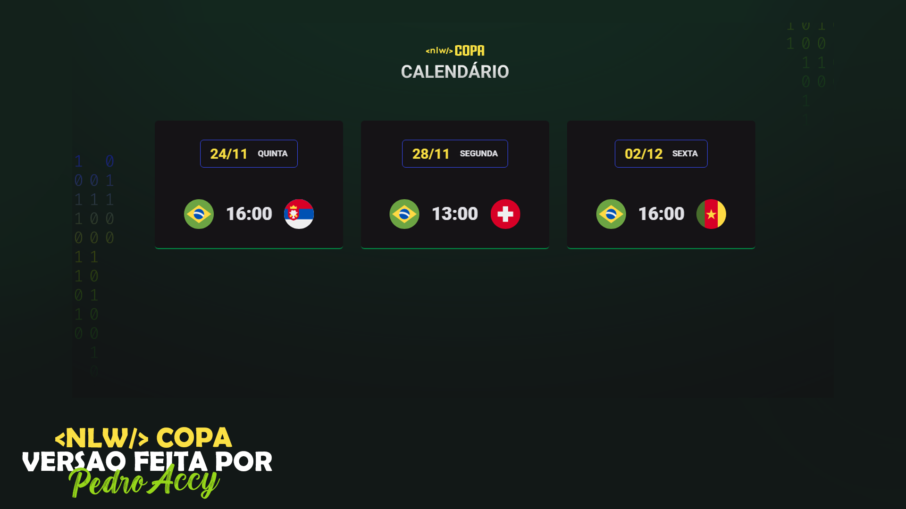

# NLW Copa

> Trilha Explorer

Projeto construído do evento Next Level Week da Rocketseat.

## 🛠 Tecnologias

- HTML e CSS
- JavaScript
- Git e Github

## 💻 Projeto

O calendário da copa é um projeto que mostra os jogos do Brasil na Copa de 2022.

## 📱 Layout

Você pode visualizar o layout do projeto através [desse link](<https://www.figma.com/file/BvErsQJ5uetONg1xTqGVv4/Calendário-de-Jogos-(Community)>). É necessário ter conta no [Figma](https://figma.com) para acessá-lo.

## 💛 Contato

pedroaccy@gmail.com
